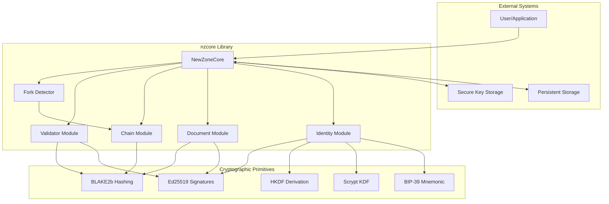
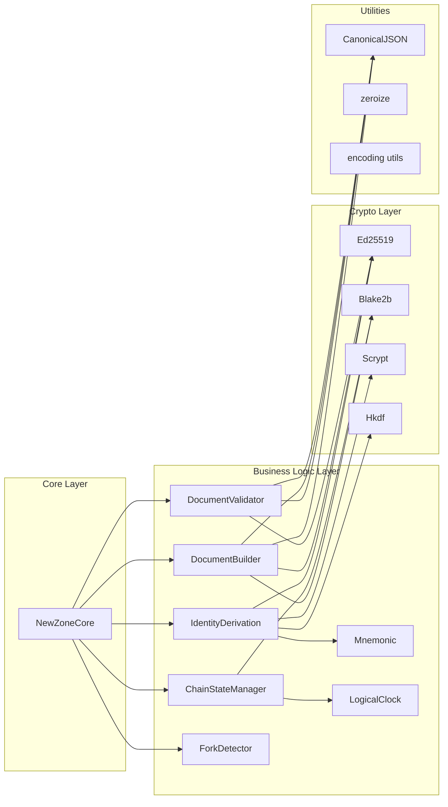
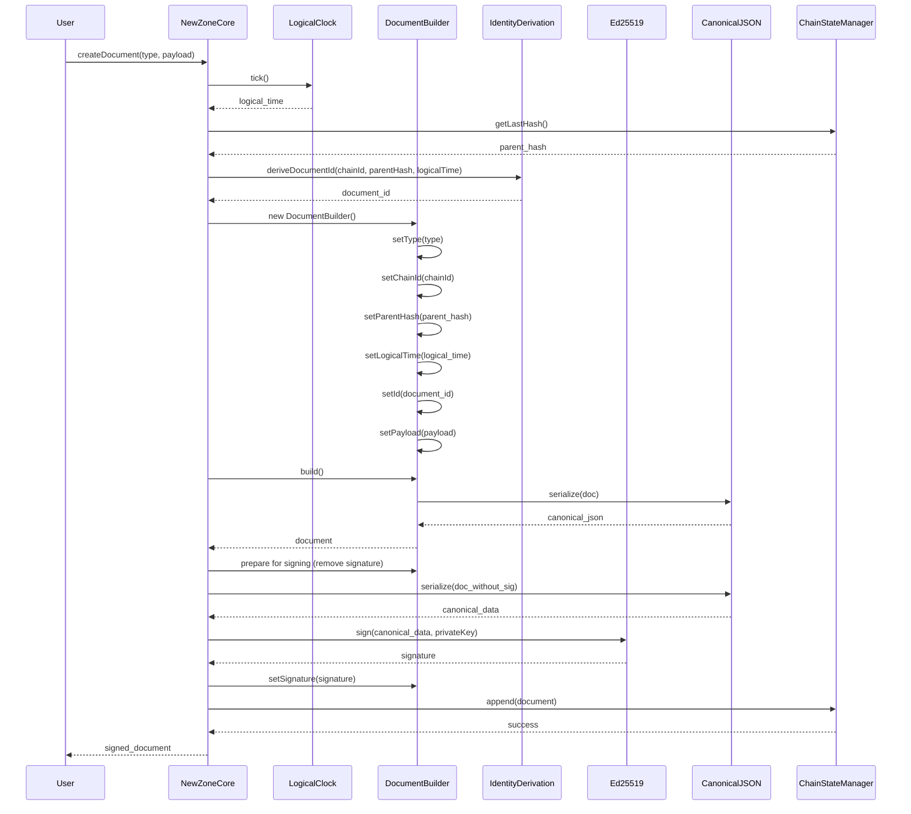
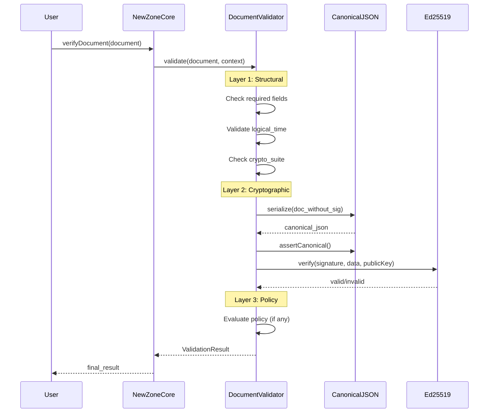
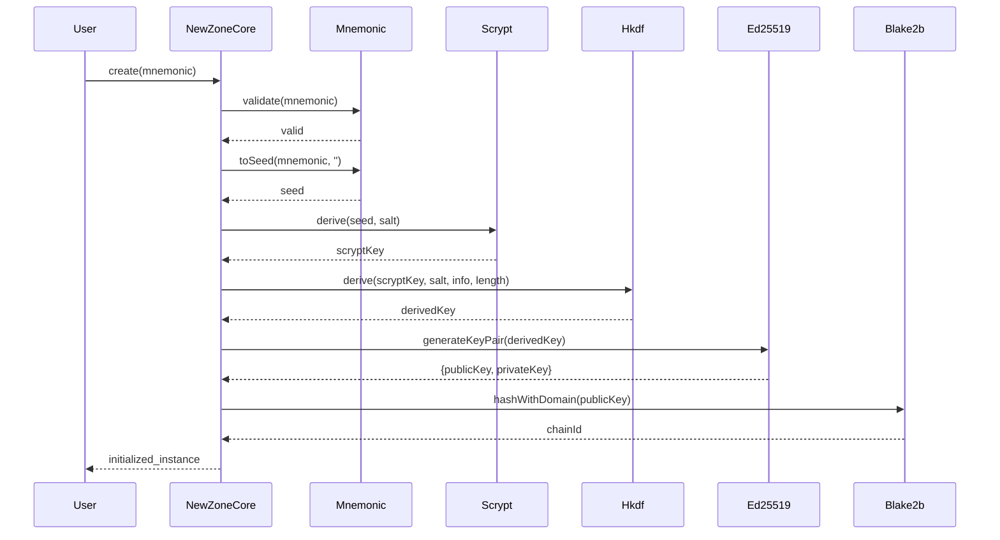
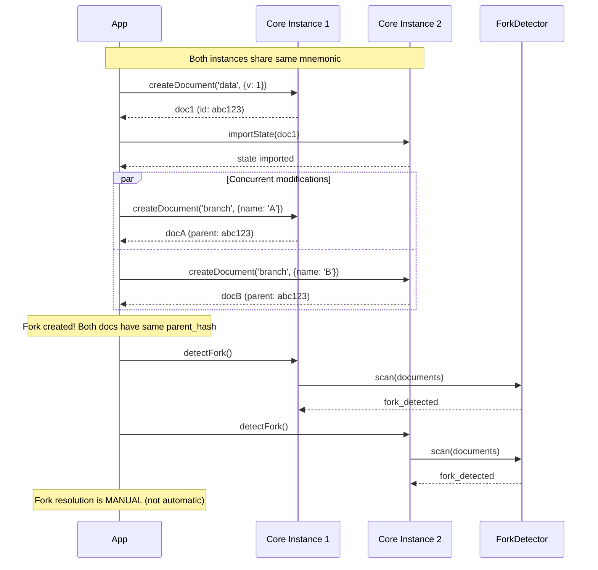
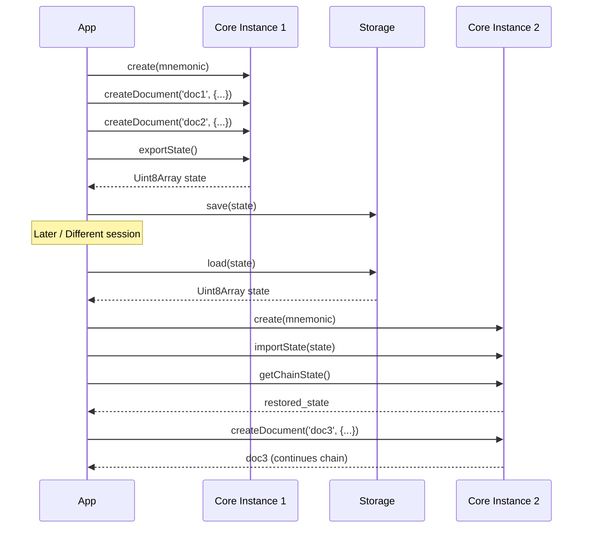

# Architecture

This document describes the architecture of **nzcore** — a personal autonomous Root of Trust system.

---

## 📋 Table of Contents

- [High-Level Architecture](#-high-level-architecture)
- [System Context Diagram](#-system-context-diagram)
- [Component Architecture](#-component-architecture)
- [Data Flow](#-data-flow)
- [Sequence Diagrams](#-sequence-diagrams)
- [Technology Stack](#-technology-stack)
- [Directory Structure](#-directory-structure)
- [Design Principles](#-design-principles)

---

## 🏗️ High-Level Architecture

nzcore is designed as a **deterministic cryptographic library** that creates and manages a chain of signed documents. The system operates entirely offline with no external dependencies for security-critical operations.

### Core Concepts

```
┌─────────────────────────────────────────────────────────────────┐
│                        nzcore Library                            │
│                                                                  │
│  ┌──────────────┐    ┌──────────────┐    ┌──────────────┐      │
│  │   Identity   │───▶│   Document   │───▶│    Chain     │      │
│  │  Derivation  │    │   Builder    │    │    State     │      │
│  └──────────────┘    └──────────────┘    └──────────────┘      │
│         │                   │                   │               │
│         ▼                   ▼                   ▼               │
│  ┌──────────────┐    ┌──────────────┐    ┌──────────────┐      │
│  │  BIP-39 +    │    │  RFC 8785    │    │   Logical    │      │
│  │  Ed25519     │    │  Canonical   │    │    Time      │      │
│  └──────────────┘    └──────────────┘    └──────────────┘      │
│                                                                  │
│  ┌──────────────────────────────────────────────────────────┐   │
│  │              Trust Validation Layers                      │   │
│  │   Structural → Cryptographic → Policy                     │   │
│  └──────────────────────────────────────────────────────────┘   │
└─────────────────────────────────────────────────────────────────┘
```

---

## 🔄 System Context Diagram



---

## 🧩 Component Architecture

### Core Components

| Component | Responsibility | Key Files |
|-----------|---------------|-----------|
| **NewZoneCore** | Main entry point, orchestrates all operations | `src/core.ts` |
| **Identity Module** | Mnemonic handling, key derivation | `src/identity/` |
| **Document Module** | Document creation, signing, validation | `src/document/` |
| **Chain Module** | Chain state management, fork detection | `src/chain/` |
| **Crypto Module** | Cryptographic primitives | `src/crypto/` |
| **Utils Module** | Encoding, memory zeroization | `src/utils/` |

### Component Diagram



---

## 📊 Data Flow

### Document Creation Flow



### Document Verification Flow



### Identity Derivation Flow



---

## 🔀 Sequence Diagrams

### Fork Detection Scenario



### State Export/Import Scenario



---

## 🛠️ Technology Stack

### Languages & Runtimes

| Technology | Version | Purpose |
|------------|---------|---------|
| TypeScript | 5.3+ | Primary language |
| JavaScript (ES2020) | ESNext modules | Runtime target |
| Node.js | 18.0.0+ | Runtime environment |

### Cryptographic Libraries

| Library | Version | Purpose |
|---------|---------|---------|
| @noble/ed25519 | 1.7.3 | Ed25519 signatures |
| @noble/hashes | 1.4.0+ | BLAKE2b, SHA-512 |
| @scure/bip39 | 1.3.0+ | BIP-39 mnemonic |
| canonicalize | 2.1.0 | RFC 8785 JSON canonicalization |

### Development Tools

| Tool | Purpose |
|------|---------|
| TypeScript Compiler | Type checking, transpilation |
| ESLint | Code linting |
| TypeDoc | API documentation generation |
| c8 | Code coverage |
| Node.js test runner | Unit and integration testing |

### Build Targets

| Target | Output | Use Case |
|--------|--------|----------|
| ESM | `dist/esm/` | Modern bundlers, browsers |
| CJS | `dist/cjs/` | Node.js require() |
| Types | `dist/types/` | TypeScript definitions |

---

## 📁 Directory Structure

```
nzcore/
├── src/                          # Source code
│   ├── index.ts                  # Main entry point (public API)
│   ├── core.ts                   # NewZoneCore main class
│   ├── types.ts                  # TypeScript type definitions
│   ├── constants.ts              # System constants
│   │
│   ├── identity/                 # Identity management
│   │   ├── mnemonic.ts           # BIP-39 mnemonic handling
│   │   ├── derivation.ts         # Key derivation (Scrypt → HKDF → Ed25519)
│   │   ├── factory.ts            # Identity factory functions
│   │   └── logical-time.ts       # Logical clock implementation
│   │
│   ├── document/                 # Document system
│   │   ├── builder.ts            # Fluent document builder
│   │   ├── canonical.ts          # RFC 8785 canonicalization
│   │   └── validator.ts          # Three-layer validation
│   │
│   ├── chain/                    # Chain state management
│   │   ├── state.ts              # ChainStateManager
│   │   └── fork.ts               # Fork detection
│   │
│   ├── crypto/                   # Cryptographic primitives
│   │   ├── ed25519.ts            # Ed25519 signatures
│   │   ├── blake2b.ts            # BLAKE2b hashing
│   │   ├── scrypt.ts             # Scrypt KDF
│   │   └── hkdf.ts               # HKDF key derivation
│   │
│   └── utils/                    # Utilities
│       ├── zeroize.ts            # Secure memory zeroization
│       └── encoding.ts           # Hex, Base64URL encoding
│
├── test/                         # Test files
│   ├── integration.test.ts       # Integration tests
│   ├── debug.test.ts             # Debug tests
│   ├── minimal.test.ts           # Minimal tests
│   └── mnemonic-debug.test.ts    # Mnemonic tests
│
├── examples/                     # Usage examples
│   ├── basic-usage.ts            # Basic example
│   └── advanced-usage.ts         # Advanced example
│
├── specs/                        # Technical specifications
│   ├── API_SPEC.md               # API specification
│   ├── ARCHITECTURE_NZCORE.md    # Architecture spec
│   ├── CRYPTO_SPEC.md            # Cryptographic spec
│   ├── DOCUMENT_SYSTEM.md        # Document system spec
│   ├── FORK_MODEL.md             # Fork model spec
│   ├── IDENTITY_MODEL.md         # Identity model spec
│   ├── SECURITY.md               # Security overview
│   ├── THREAT_MODEL.md           # Threat model
│   ├── TIME_MODEL.md             # Time model spec
│   ├── TRUST_MODEL.md            # Trust model spec
│   ├── CRYPTO_AGILITY.md         # Crypto agility spec
│   ├── ENVIRONMENT.md            # Environment spec
│   └── CONTRIBUTING.md           # Contribution guidelines
│
├── docs/                         # Generated TypeDoc documentation
│
├── dist/                         # Build output
│   ├── esm/                      # ES modules
│   ├── cjs/                      # CommonJS modules
│   └── types/                    # TypeScript definitions
│
├── package.json                  # Package configuration
├── tsconfig.json                 # TypeScript configuration
├── tsconfig.esm.json             # ESM build config
├── tsconfig.cjs.json             # CJS build config
├── tsconfig.types.json           # Types build config
├── typedoc.json                  # TypeDoc configuration
├── eslint.config.js              # ESLint configuration
└── README.md                     # This documentation
```

---

## 🎯 Design Principles

### 1. Determinism

All operations MUST be deterministic. Given the same input, the output MUST always be identical.

```typescript
// Same mnemonic always produces same identity
const core1 = await NewZoneCore.create(MNEMONIC);
const core2 = await NewZoneCore.create(MNEMONIC);
// core1.getPublicKeyHex() === core2.getPublicKeyHex()
```

### 2. No External Dependencies

Security-critical operations MUST NOT depend on:
- System wall-clock time
- Network connectivity
- External services

### 3. Logical Time

Logical time is authoritative over wall-clock time:
- Monotonic counter (always increases)
- Used for ordering, expiration, revocation
- Stored in chain state

### 4. Fork Detection (Not Resolution)

The core:
- ✅ MUST detect forks automatically
- ❌ MUST NOT resolve forks automatically
- ⚠️ Resolution is manual (application responsibility)

### 5. Secure Memory

All sensitive data MUST be zeroized:
- Private keys after use
- Mnemonic phrases
- Derived seeds

### 6. Three-Layer Trust

Validation follows strict layering:

```
Trust = Structural ∧ Cryptographic ∧ Policy
```

| Layer | Checks |
|-------|--------|
| **Structural** | Required fields, formats, invariants |
| **Cryptographic** | Signatures, canonical JSON, key validity |
| **Policy** | Application-specific rules (optional) |

### 7. Crypto Agility

Documents include `crypto_suite` field for future algorithm migration:

```typescript
{
  "crypto_suite": "nzcore-crypto-01",
  // ... other fields
}
```

---

## 🔗 Related Documents

- [API Reference](./API.md) — Complete API documentation
- [Security Model](./SECURITY.md) — Security principles and practices
- [Deployment Guide](./DEPLOYMENT.md) — Build and deployment instructions
- [Contributing](./CONTRIBUTING.md) — Development guidelines

---

*Last updated: February 20, 2026*
