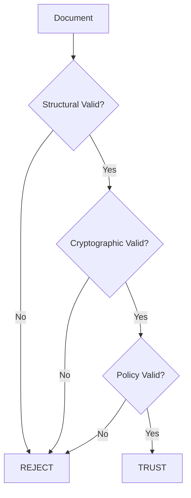

# Security

Security documentation for **nzcore** — Personal autonomous Root of Trust.

---

## 📋 Table of Contents

- [Security Overview](#-security-overview)
- [Cryptographic Stack](#-cryptographic-stack)
- [Security Principles](#-security-principles)
- [Threat Model](#-threat-model)
- [Trust Model](#-trust-model)
- [Memory Security](#-memory-security)
- [Key Management](#-key-management)
- [Document Security](#-document-security)
- [Best Practices](#-best-practices)
- [Known Limitations](#-known-limitations)
- [Reporting Vulnerabilities](#-reporting-vulnerabilities)

---

## 🔒 Security Overview

nzcore is designed as a **personal autonomous Root of Trust** system. It provides cryptographic identity and document signing without relying on external services or authorities.

### Security Goals

| Goal | Description |
|------|-------------|
| **Deterministic Identity** | Identity derived solely from user's mnemonic |
| **Tamper-Evident Documents** | Any modification invalidates signatures |
| **Offline Operation** | No network dependencies for security |
| **Forward Security** | Past documents remain valid even if current state is compromised |
| **Memory Safety** | Sensitive data zeroized after use |

### Non-Goals

nzcore does **NOT** protect against:

- Compromised operating systems
- Hardware-level attacks
- Side-channel attacks beyond timing
- Physical coercion
- Lost mnemonics (no recovery mechanism)

---

## 🔐 Cryptographic Stack

### nzcore-crypto-01 Suite

| Algorithm | Implementation | Parameters |
|-----------|----------------|------------|
| **Digital Signatures** | Ed25519 (@noble/ed25519 v1.7.3) | Standard |
| **Hashing** | BLAKE2b-256 (@noble/hashes) | 256-bit output |
| **Key Derivation** | Scrypt | N=32768, r=8, p=1, dkLen=64 |
| **Key Expansion** | HKDF-SHA256 | Standard |
| **Mnemonic** | BIP-39 (@scure/bip39) | 256-bit entropy |
| **Canonicalization** | RFC 8785 JSON | Deterministic serialization |

### Identity Derivation Path

```
┌─────────────────┐
│  BIP-39 Seed    │ 64 bytes
└────────┬────────┘
         │
         ▼
┌─────────────────┐
│  Scrypt KDF     │ N=32768, r=8, p=1
└────────┬────────┘
         │
         ▼
┌─────────────────┐
│  HKDF-SHA256    │ Info: "ed25519-root-key"
└────────┬────────┘
         │
         ▼
┌─────────────────┐
│  Ed25519 Key    │ 32 bytes private key
└────────┬────────┘
         │
         ▼
┌─────────────────┐
│  Ed25519 KeyPair│ Public + Private
└─────────────────┘
```

### Cryptographic Agility

Documents include the `crypto_suite` field for future algorithm migration:

```typescript
{
  "crypto_suite": "nzcore-crypto-01",
  // ... other fields
}
```

**Migration Policy:**
- Old documents remain verifiable with deprecated suites
- New documents MUST use current suite
- Suite deprecation announced with 12-month notice

---

## 🛡️ Security Principles

### 1. Determinism

All security-critical operations are deterministic:

```typescript
// Same mnemonic ALWAYS produces same identity
const core1 = await NewZoneCore.create(MNEMONIC);
const core2 = await NewZoneCore.create(MNEMONIC);
assert(core1.getPublicKeyHex() === core2.getPublicKeyHex());
```

**Benefits:**
- Reproducible identity recovery
- No randomness dependencies
- Audit-friendly

### 2. No External Dependencies

Security decisions do NOT depend on:

- ❌ System wall-clock time
- ❌ Network connectivity
- ❌ External time servers
- ❌ Third-party services

**Exception:** System entropy for initial mnemonic generation only.

### 3. Logical Time Authority

Logical time is the authoritative ordering mechanism:

| Property | Guarantee |
|----------|-----------|
| **Monotonicity** | time(n+1) > time(n) |
| **Persistence** | Stored in chain state |
| **Verification** | Checked during validation |

**Wall-clock time** (`created_at`) is informational only.

### 4. Defense in Depth

Three-layer validation:

```
Trust = Structural ∧ Cryptographic ∧ Policy
```

| Layer | Checks | Bypass |
|-------|--------|--------|
| **Structural** | Required fields, formats | ❌ Never |
| **Cryptographic** | Signatures, canonical JSON | ❌ Never |
| **Policy** | Application rules | ✅ Optional |

### 5. Secure Memory Lifecycle

```
┌──────────────┐     ┌──────────────┐     ┌──────────────┐
│   Create     │────▶│     Use      │────▶│   Destroy    │
│  (allocate)  │     │  (operate)   │     │  (zeroize)   │
└──────────────┘     └──────────────┘     └──────────────┘
```

**Zeroization:**
- 3-pass overwrite
- Constant-time comparison
- Immediate nullification

---

## ⚠️ Threat Model

### Assumed Adversaries

| Adversary | Capability | Protection |
|-----------|------------|------------|
| **Local Malware** | File system access | Encrypted storage |
| **Physical Theft** | Device access | Mnemonic passphrase |
| **File Tampering** | Document modification | Cryptographic signatures |
| **Clock Manipulation** | System time changes | Logical time |
| **Network Attacker** | MITM, replay | Offline operation |

### Out of Scope

| Threat | Reason |
|--------|--------|
| **Compromised OS** | Cannot protect against kernel-level attacks |
| **Hardware Attacks** | Requires hardware security module |
| **Side-Channel (non-timing)** | Beyond software control |
| **Quantum Computers** | Future post-quantum migration planned |
| **Social Engineering** | User education required |

### Attack Surface Analysis

| Component | Risk Level | Mitigation |
|-----------|------------|------------|
| **Mnemonic Storage** | 🔴 High | User responsibility, encryption |
| **Private Key Memory** | 🔴 High | Zeroization, short lifetime |
| **Document Verification** | 🟡 Medium | Three-layer validation |
| **Fork Detection** | 🟡 Medium | Manual resolution required |
| **Canonical JSON** | 🟢 Low | Well-tested library |

---

## 🔗 Trust Model

### Trust Layers



### Structural Validation

Checks performed:

```typescript
// Required fields present
const required = ['type', 'version', 'id', 'chain_id', 
                  'parent_hash', 'logical_time', 'crypto_suite'];

// Logical time invariant
assert(doc.logical_time >= 1);

// Crypto suite match
assert(doc.crypto_suite === 'nzcore-crypto-01');

// Version check
assert(doc.version === '1.0');

// Signature presence
assert(doc.signature !== undefined);
```

### Cryptographic Validation

Checks performed:

```typescript
// 1. Verify canonical JSON
await CanonicalJSON.assertCanonical(canonical);

// 2. Verify signature
const valid = await Ed25519.verify(signature, data, publicKey);

// 3. Check trusted keys
assert(trustedKeys.includes(signingKey));
```

### Policy Validation

Application-defined rules (examples):

- Time-based expiration
- Access control lists
- Rate limiting
- Semantic validation

---

## 💾 Memory Security

### Zeroization Implementation

```typescript
export function zeroize(array: Uint8Array): void {
  if (!array) return;

  try {
    // 3-pass overwrite
    for (let i = 0; i < 3; i++) {
      array.fill(0);
      
      // Prevent dead store elimination
      if (array[0] !== 0) {
        array.fill(0);
      }
    }
  } catch (e) {
    throw new Error('Failed to zeroize memory');
  }
}
```

### Data Lifecycle

| Data Type | Created | Zeroized After |
|-----------|---------|----------------|
| **Mnemonic** | Generation/Import | Instance destruction |
| **Private Key** | Key derivation | Each use |
| **Derived Seeds** | HKDF/Scrypt | Key derivation |
| **Intermediate Buffers** | Operations | Operation complete |

### SecureBuffer Class

```typescript
import { SecureBuffer } from 'nzcore';

const buffer = new SecureBuffer(64);
try {
  // Use buffer.data
  performOperation(buffer.data);
} finally {
  buffer.destroy(); // Automatic zeroization
}
```

---

## 🔑 Key Management

### Mnemonic Security

**Generation:**
```typescript
import { generateIdentity, Mnemonic } from 'nzcore';

const { mnemonic } = await generateIdentity();
// 24 words, 256 bits of entropy
```

**Storage Best Practices:**

| Method | Security Level | Recommendation |
|--------|----------------|----------------|
| **Paper Backup** | 🔒 High | Store in safe/fireproof |
| **Metal Backup** | 🔒🔒 Very High | Fire/water proof |
| **Hardware Wallet** | 🔒🔒🔒 Maximum | Best for large values |
| **Encrypted Digital** | 🔒 Medium | Use strong encryption |
| **Plain Text File** | ❌ Never | Extremely dangerous |

**NEVER:**
- Store in code repositories
- Send via email/messaging
- Store in environment variables
- Keep in cloud storage unencrypted

### Key Derivation Security

```typescript
// Derivation is deterministic and one-way
// Mnemonic → Seed → Private Key

// Cannot reverse: Private Key → Mnemonic
// Cannot derive: Mnemonic from Private Key
```

### Key Rotation

nzcore does **NOT** support key rotation by design:

- Identity IS the mnemonic
- Changing mnemonic = new identity
- Historical documents remain valid under old identity

**For key compromise:**
1. Create new identity with new mnemonic
2. Create revocation document on old chain (if possible)
3. Notify counterparties of new identity

---

## 📄 Document Security

### Signature Coverage

Signatures cover:

```typescript
{
  type,
  version,
  id,
  chain_id,
  parent_hash,
  logical_time,
  crypto_suite,
  created_at,
  payload
}
```

Signature does **NOT** cover:
- The `signature` field itself (obviously)
- Unknown fields added after signing

### Canonical JSON Security

**Why Canonical JSON?**

Without canonicalization:

```javascript
// These are equal but hash differently:
JSON.stringify({a: 1, b: 2})  // '{"a":1,"b":2}'
JSON.stringify({b: 2, a: 1})  // '{"b":2,"a":1}'
```

With RFC 8785:

```javascript
await CanonicalJSON.serialize({a: 1, b: 2})
// Always: '{"a":1,"b":2}' (keys sorted)

await CanonicalJSON.serialize({b: 2, a: 1})
// Always: '{"a":1,"b":2}' (keys sorted)
```

### Tamper Detection

```typescript
const original = await core.createDocument('data', { value: 100 });

// Attacker modifies document
const tampered = { ...original, payload: { value: 999 } };

// Verification fails
const result = await core.verifyDocument(tampered);
console.log(result.cryptographic_valid); // false
console.log(result.final); // false
```

### Fork Security

**Fork Definition:** Two documents with the same `parent_hash`.

**Detection:**
```typescript
const forks = core.detectFork();
if (forks.length > 0) {
  console.warn('Fork detected!');
  console.log('Conflicting documents:', forks[0].documents);
}
```

**Resolution:** Manual only (by design)

```typescript
// Core does NOT auto-resolve
// Application must create merge document:
const mergeDoc = await core.createDocument('merge', {
  resolves: fork.documents,
  resolution: 'chosen_branch_A'
});
```

---

## ✅ Best Practices

### Secure Initialization

```typescript
// ✅ GOOD: Generate and immediately secure
const { mnemonic, core } = await generateIdentity();
await secureStorage.save(mnemonic); // Encrypted storage
console.log(Mnemonic.mask(mnemonic)); // Log masked version

// ❌ BAD: Logging full mnemonic
console.log(mnemonic); // NEVER DO THIS
```

### Secure Operation

```typescript
// ✅ GOOD: Use try/finally for cleanup
let core;
try {
  core = await NewZoneCore.create(mnemonic);
  const doc = await core.createDocument('data', payload);
  return doc;
} finally {
  core?.destroy(); // Always cleanup
}

// ❌ BAD: No cleanup
const core = await NewZoneCore.create(mnemonic);
const doc = await core.createDocument('data', payload);
// Private key remains in memory!
```

### Secure Storage

```typescript
// ✅ GOOD: Encrypt before storage
import { scrypt } from 'crypto';

async function encryptMnemonic(mnemonic: string, password: string) {
  const salt = crypto.getRandomValues(new Uint8Array(16));
  const key = await deriveKey(password, salt);
  const encrypted = await encrypt(mnemonic, key);
  return { salt, encrypted };
}

// ❌ BAD: Plain text storage
fs.writeFileSync('mnemonic.txt', mnemonic);
```

### Verification Best Practices

```typescript
// ✅ GOOD: Full validation
const result = await core.verifyDocument(doc);
if (!result.final) {
  throw new Error(`Validation failed: ${result.errors?.join(', ')}`);
}

// ✅ GOOD: Check specific layers
if (!result.cryptographic_valid) {
  throw new Error('Signature invalid');
}

// ❌ BAD: No validation
// Using document without verification
```

### Fork Handling

```typescript
// ✅ GOOD: Regular fork detection
async function safeCreateDocument(core: NewZoneCore, type: string, payload: any) {
  // Check for existing forks
  const forks = core.detectFork();
  if (forks.length > 0) {
    throw new Error('Resolve existing forks before creating documents');
  }
  
  return core.createDocument(type, payload);
}

// ❌ BAD: Ignoring forks
// Creating documents without checking chain state
```

---

## ⚠️ Known Limitations

### 1. No Recovery Mechanism

**Limitation:** Lost mnemonic = lost identity

**Mitigation:**
- Create multiple secure backups
- Consider Shamir's Secret Sharing for enterprise
- Use hardware security modules

### 2. No Built-in Encryption

**Limitation:** Payloads are not encrypted

**Mitigation:**
- Encrypt sensitive data before creating documents
- Use application-layer encryption

```typescript
const encryptedPayload = await encrypt(sensitiveData, key);
const doc = await core.createDocument('encrypted', { data: encryptedPayload });
```

### 3. Manual Fork Resolution

**Limitation:** Core detects but doesn't resolve forks

**Mitigation:**
- Implement application-specific resolution policies
- Use single-writer pattern where possible

### 4. Memory Limitations

**Limitation:** Large chains consume memory

**Mitigation:**
- Export/import state for persistence
- Implement pagination for large document sets

---

## 🐛 Reporting Vulnerabilities

### Responsible Disclosure

1. **DO NOT** disclose publicly before coordinated resolution
2. **DO** send detailed report to maintainers privately
3. **DO** allow reasonable time for fix development

### Report Format

```
Subject: [Security] Brief description

## Summary
One-line description of the vulnerability

## Impact
What an attacker could achieve

## Reproduction
Step-by-step reproduction instructions

## Environment
- nzcore version:
- Node.js version:
- Operating system:

## Suggested Fix (optional)
Your recommendation for fixing the issue
```

### Response Timeline

| Stage | Timeline |
|-------|----------|
| **Acknowledgment** | Within 48 hours |
| **Initial Assessment** | Within 1 week |
| **Fix Development** | 2-4 weeks |
| **Public Disclosure** | After fix released |

---

## 🔗 Related Documents

- [Architecture](./ARCHITECTURE.md) — System architecture
- [API Reference](./API.md) — Complete API documentation
- [Threat Model](./specs/THREAT_MODEL.md) — Detailed threat analysis
- [Crypto Spec](./specs/CRYPTO_SPEC.md) — Cryptographic specifications

---

*Last updated: February 20, 2026*
